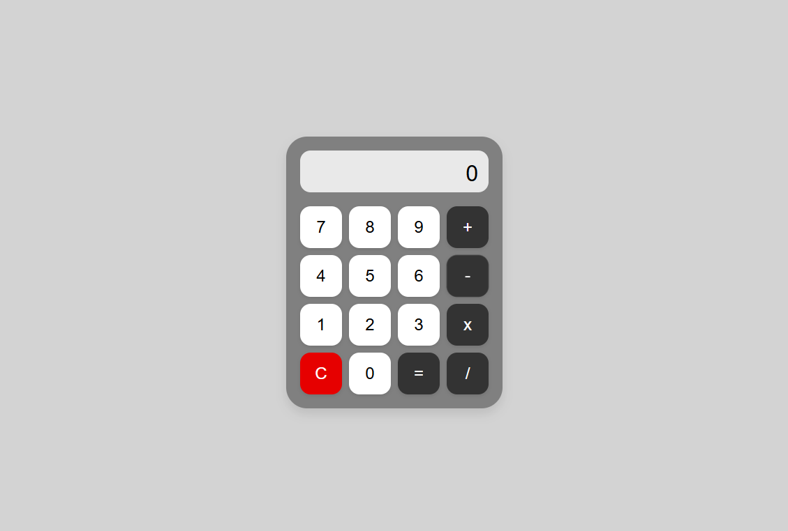

# Calculadora

## 📋 Descrição

Projeto de uma calculadora que realiza soma, subtração, multiplicação e divisão. O front-end permite a entrada dos números e seleção das operações, enquanto o back-end processa os cálculos e retorna os resultados.

## 🛠️ Tecnologias

- NodeJs
- ReactJs

## 🌍 Acesse o projeto

Você pode acessar o projeto online clicando no link abaixo:  
👉  [Cadastro de Usuário](https://calculadora-9rzc.vercel.app)

## Imagem do projeto
   

